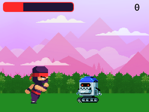

# bevy Nanonauts

### The Coder Dojo infinite runner remade in the Bevy engine.

This is my first big project in Bevy and my first game publicly published! It's yet another infinite runner. Time your jumps (_spacebar_) to leap over as many robots as you can before your health runs out! Play it on [itch.io](https://hadan24.itch.io/bevy-nanonauts)!

--- 

The game is arguably "complete" as is, but I have lots of ideas for things to add whenever I come back to this! Future updates may include (in no particular order):

- mobile support
- more interesting backgrounds
- slightly varied or more interesting jump mechanics
- music + sound effects
- handmade tutorial screen + animation
- more challenging enemy behaviors
- more interesting "game over" screen
- new features/mechanics for power-ups or extra score
- improved performance

## Building
### On Native
1. `cargo build` or `cargo run`

Nothing special needed! If you're adding to this project,
be sure to edit the `Cargo.toml` to turn `dynamic_linking` back on!
It was a massive improvement to iteration times for me!

### For the Web/WASM
I personally used the [`wasm-bindgen-cli`](https://crates.io/crates/wasm-bindgen) and
[`basic-http-server`](https://crates.io/crates/basic-http-server) for development.

1. `cargo build --target wasm32-unknown-unknown`
2. `wasm-bindgen target/wasm32-unknown-unknown/[profile]/bevy-nanonauts.wasm --out-dir dist --target web`
3. `cp -r assets dist/assets`
4. `basic-http-server dist`